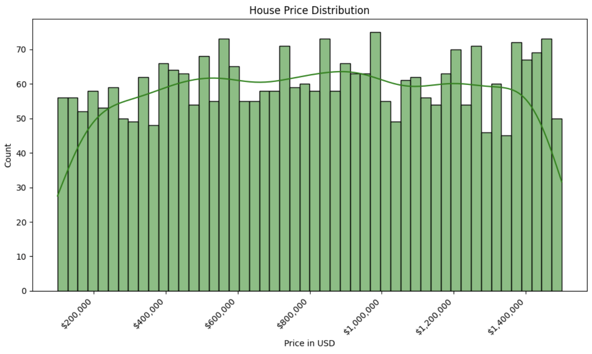
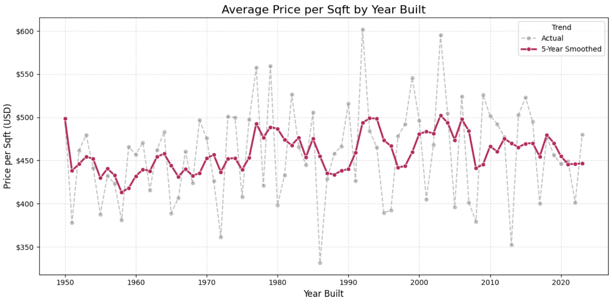
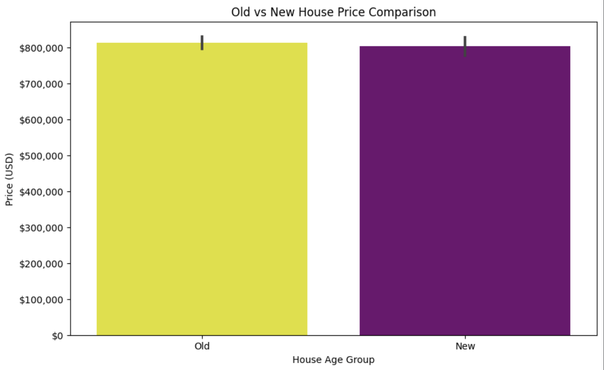
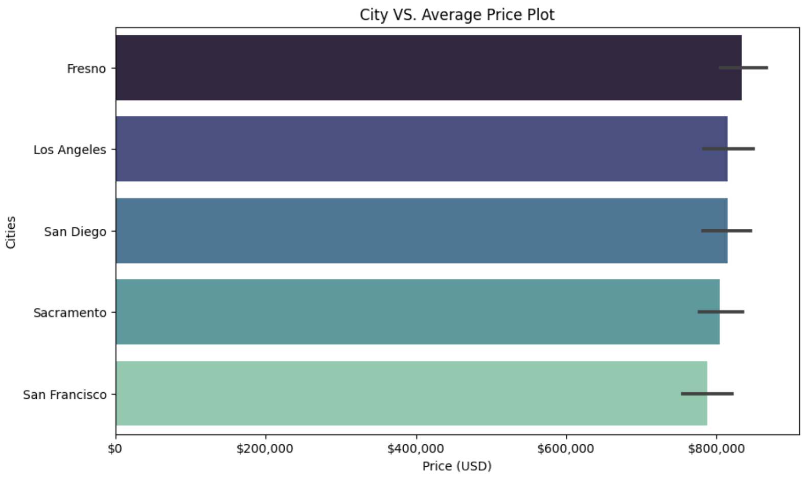
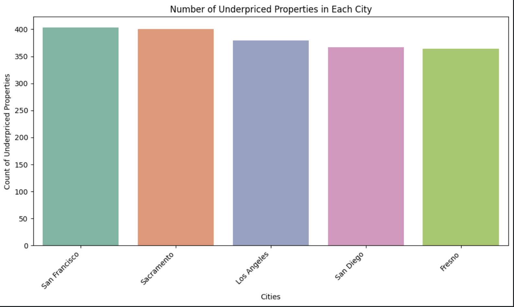
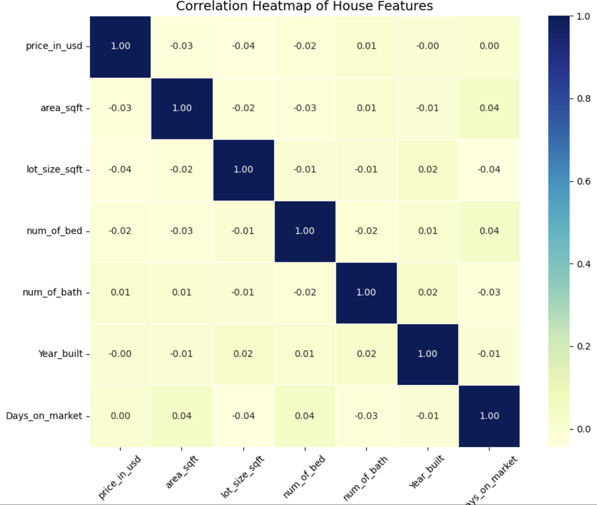
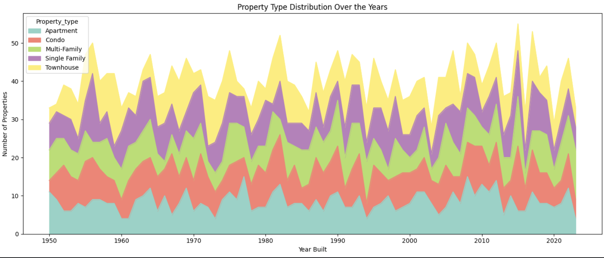
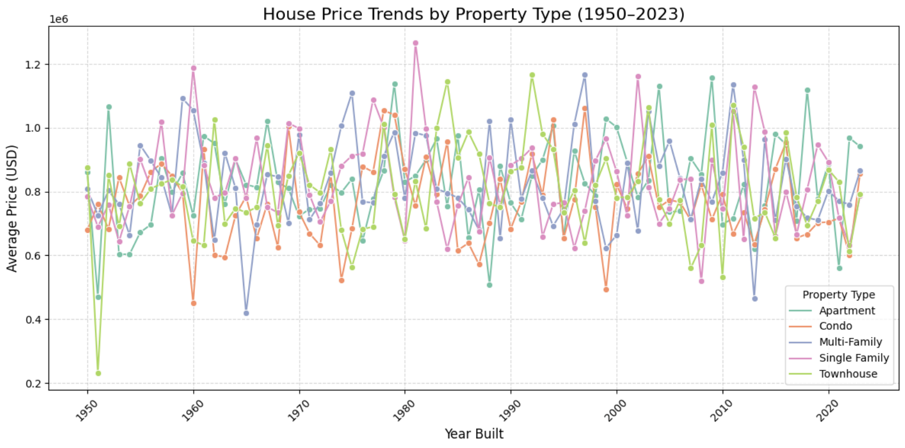
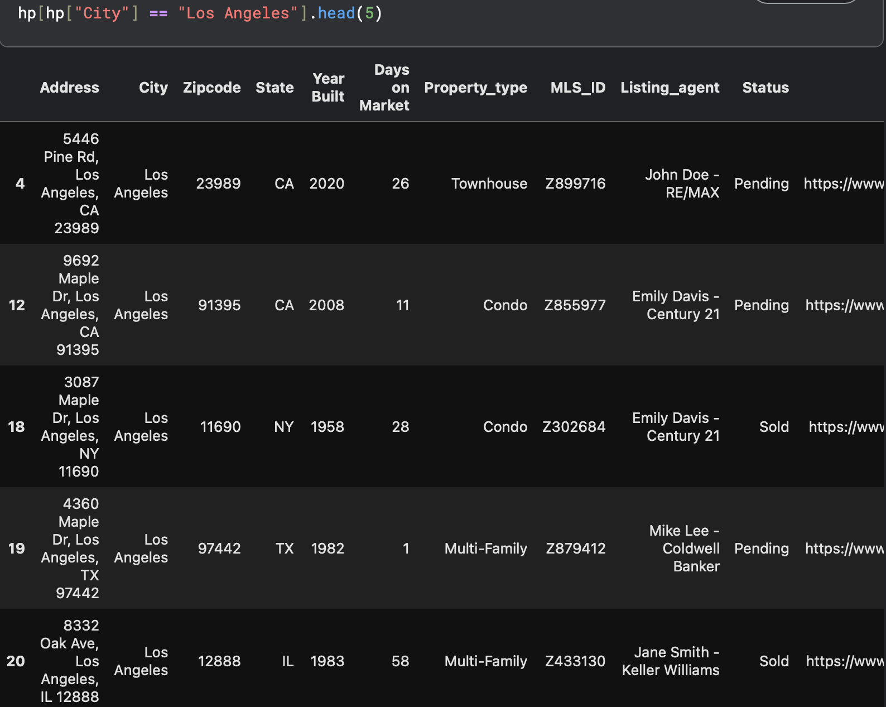

# "Built to Sell: ML for House Status

## Goal
Through exploratory data analysis and machine learning (Logistic Regression, Random Forest, SVM, XGBoost), this project predicts house sale status. It delivers insights from key property features, benefiting real estate professionals and house seekers

---

## Background
Understanding the dynamics of the residential real estate market is crucial for investors, agents, and prospective homeowners alike. Predicting whether a property will be sold, and what factors influence that outcome, can provide significant strategic advantages in a competitive market.

This project utilizes a real-world dataset covering various USA house listings,specifially in California, detailing essential property features, listing specifics, and crucially, their eventual sale status. The primary objective is to leverage this data to build robust machine learning models capable of predicting property sales outcomes accurately.

A core challenge encountered was addressing critical data integrity issues, specifically geographic inconsistencies where listed cities did not always match their corresponding states. Extensive data preprocessing, meticulous feature engineering (such as deriving price ratios), and comprehensive model tuning were undertaken to overcome these obstacles and enhance the dataset's predictive signal.

---

## Insights Summary

### Location Influence
- Sacramento and Los Angeles had the highest share of sold listings, suggesting higher demand in these markets compared to cities like Fresno or San Francisco.
- San Francisco underperforms in average price even though it is often considered a premium market, its average sale price ($788k) is the lowest among the five cities. That may reflect a concentration of lower-value properties sold recently or a cooling trend in that segment of the market.
- Sacramento is a more liquid market — homes sell more frequently but at slightly lower price points, its average price ($804k) is slightly lower than Fresno, LA, and San Diego.

### Property Size and Configuration
- While condos have the lowest average total price, they don’t offer the best value per square foot. Single-family homes have the highest price per sqft, showing they command premium space.
- Apartments in Fresno ($912K) and single-family homes in San Diego ($865K) rank among the most expensive. On the flip side, condos in Sacramento and San Francisco consistently appear in the lowest price brackets.
- 2-bedroom homes have the highest median sale price (~$870K), even more than 4- or 6-bedroom properties. This suggests smaller, well-located or luxury properties are in high demand over sheer size.

### Property Age and Market Trends
- A significant 67% of homes were built before 2000 (2,013 out of 3,000), showing the market leans toward established, possibly renovated properties rather than new developments.
- Old doesn’t mean cheap — older homes average higher prices ($814K) than newer ones ($803K), suggesting buyers may be paying for land, location, or charm over modern construction.
- The price difference between old and new homes is most pronounced in single-family homes, where older units cost ~$25K more. This may reflect larger lot sizes or better neighborhoods.

### Underprice Segment Analysis
- Apartments in San Francisco and San Diego are significantly underpriced, averaging $570K–$633K, far below cities like Fresno. Meanwhile, townhouses in Los Angeles average only $527K, the lowest across all segments, revealing strong bargain potential.
- With average prices ranging from $557K in Sacramento to $660K in Fresno, condos emerge as one of the most underpriced and accessible property types, especially for entry-level buyers or investors targeting rental yields.
- Despite being a high-cost city, San Francisco properties (apartments, condos, and single-family homes) appear in the lowest average underpriced listings, indicating market-wide price corrections or opportunity pockets even in premium neighborhoods.

---

## Recommendations
- For investors and first-time buyers, the under-price analysis highlights promising opportunities within the apartment and townhouse segments of Los Angeles and San Francisco. Highly recommend exploring these areas for potential appreciation and value gains.
- For entry-level investors or buyers: Condos in Sacramento and Fresno show consistently lower average prices per square foot, making them ideal for seeking affordability with steady long-term potential.

- Locations matter: While the number of bedrooms showed some correlation with price, city-level influence was far more significant. Prioritize location over layout when filtering potential properties—especially in fluctuating markets like Los Angeles and San Francisco.
- House old matters: Contrary to common belief, newer properties (built ≥ 2000) are not always more expensive. In fact, older homes averaged slightly higher prices. Buyers should assess property condition and value, not just age, when making decisions.

---

## Data Preprocessing Steps

The raw dataset underwent comprehensive preprocessing to ensure data quality, consistency, and suitability for both exploratory data analysis and machine learning model training. These steps were divided based on the analytical objective:

#### 1. Preprocessing for General Descriptive Analysis (EDA)

The goal here was to clean and transform raw property listing data for EDA and insight generation, the following transformations were applied:

- Column Renaming: Long column names were standardized (e.g., `Area (Sqft)` → `area_sqft`, `Lot Size` → `lot_size`).
- Data Type Conversion: Key fields like `City`, `State`, `Property Type` were explicitly cast as strings for clarity and consistency.
- Numeric Extraction: Bedroom, bathroom, area, and lot size values were cleaned by stripping non-numeric characters (e.g., “3 Beds” → 3).
- Currency Conversion: The `Price` column was stripped of $ and , symbols and converted to numeric values (float), and renamed to `price_in_usd`.
- Address Breakdown: Extracted the street component from the full address for added granularity in location analysis.
- Geographic Correction: Fixed mismatched city–state pairs (e.g., San Diego mistakenly tagged as TX instead of CA).
- Dropped Redundant Columns: Removed unused original columns after transformation to keep the dataset lean and tidy.

#### 2. Data Preprocessing for Binary Classification Models

Building upon the general cleaning, additional steps were performed to prepare the data specifically for training machine learning models to predict `is_sold` status:
    
* **Category Encoding**:
    * Columns like `City`, `Property_type`, and `Status` converted to categorical data types.
    * One-Hot Encoding (OHE) applied to selected categorical features, with drop='first' to avoid multicollinearity.
* **Feature Engineering**:
    * Created log_price using a log1p transformation for better numeric stability.
    * Derived new binary target variable is_sold from the original "Status" field.
* **Column Reduction**:
    * Removed unnecessary columns for modeling (e.g., `URLs`, `Agent Names`, raw `Price`) to avoid data leakage and reduce noise.
* **Data Cleaning**:
    * Applied consistent formatting across numerical features.
    * Handled geographic inconsistencies similarly to the EDA version.
* **Column Reordering**:
    * Reordered columns to ensure is_sold is at the end of the DataFrame, improving readability during training.

---

## Visualizations
- Remark: visualisations are based on data in the year of 2025
1. Property Type Price Distributiuon

2. Average Price per Sqft by Year Built

3. Price Distribution By Property Type
.png) 
4. Property Type VS Average Price (USD)
.png)
5. Average Price by The Number of Bedrooms
.png)
6. Old vs New House Average Price Comparison

7. City VS. Average Price

8. Underpriced properties in each city:

9. Correlation Heatmap For House Price

10. Property Type Distribution Over the Years

11. House Price Trends by Property Type (1950–2023)

---

## Challenges Faced

### 1. Data Integrity

The dataset includes City and State columns. While there are 5 unique City values (Fresno, Los Angeles, Sacramento, San Diego, San Francisco) and 5 unique State values (CA, FL, IL, NY, TX), all the listed cities are geographically located within California (CA). For example, I've found instances where 'Los Angeles' is incorrectly listed with 'NY' as its state. This is a factual inconsistency that impacts the reliability of the data.

In order to solve this problem, I reassigned State to 'CA' for all entries. Since all the City values in the dataset are definitively in California, I can programmatically reassign the State column to 'CA' for every row, overriding the incorrect state values. This ensures factual accuracy and consistency across the dataset.

Sample of mismatched rows

### 2. Defining “Underpriced” Properties

Since there is no universal definition of what makes a property “underpriced.” I needed to carefully design a logic that flags underpriced listings based on expected price predictions from the model rather than hardcoded rules — requiring thoughtful calibration.

Solution: I did some research and concluded that I would identify underpriced properties based on price per square foot compared to the average for their property type.

### 3. Designing Actionable Insights

Without feedback or business goals, it can be difficult to decide what questions to answer or which analysis to prioritize. Creating meaningful insights required stepping into the role of a real estate analyst. 

Solution: To simulate real-world needs, I stepped into the role of a real estate analyst and asked questions a property investor or buyer might care about, such as:

Which cities have the most underpriced properties?
Which property types tend to be undervalued?
Are newly built homes priced differently than older ones?

### 4. Model's poor performace

Despite the efforts in feature engineering, hyperparameter tuning, and using a powerful model like Random Forest, the performance remains very poor for predicting whether a house will be sold. The low F1-score, low recall for the positive class, and AUC near 0.5 are consistent across your models.

This strongly reinforces the idea that the current dataset, even with the engineered features, likely lacks sufficiently strong predictive signals to accurately determine if a house will be sold.

---
## Technologies Used

- Programming Language: Python
- Data Manipulation & Analysis: Pandas, NumPy
- Data Visualization: Matplotlib, Seaborn
- Statistical Modeling & Preprocessing: Statsmodels (for VIF), Scikit-learn (for preprocessing, model selection, various models, and evaluation metrics)
- Machine Learning Models:
    **Logistic Regression**
    **Random Forest Classifier**
    **Support Vector Classifier (SVC)**
    **XGBoost Classifier**
- Jupyter / Kaggle Notebook
- Dashboard: Tableau

---

<!-- 
## Dashboard: California Underpriced Property Insights
1. Sample Dashboard

2. Sample Dashboard with interactive elements
 -->

---

## Author
Mr. Pakkapol Satthapiti
MSC of Data Science and AI | The University of Liverpool | Feel free to connect!